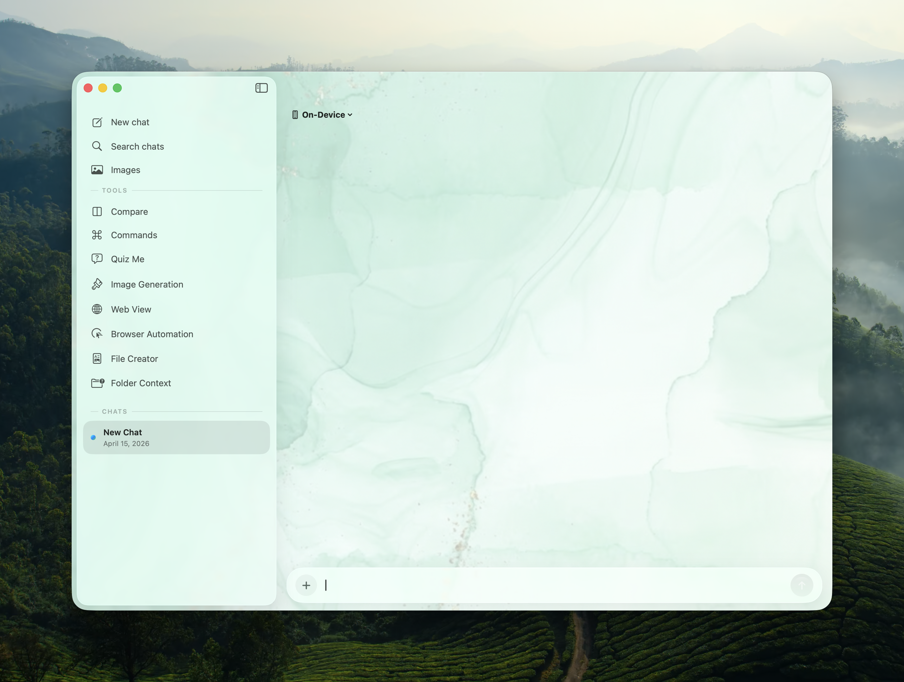

# Prism - Releases

> **⚠️ NOTE:** This repository is dedicated exclusively to hosting pre-built binary releases and tracking updates for Prism. You can download the latest version directly from the [Releases](https://github.com/gl-aarav/Prism-Releases/releases) page.

**Website:** [prism-app.tech](https://prism-app.tech) (includes changelog, pricing, and Terms of Use)  

## Prism - Your Ultimate Native AI Companion for macOS

**Prism** is a powerful, native macOS application that brings modern AI directly to your desktop. Built with SwiftUI and designed with a stunning "Liquid Glass" and macOS Tahoe aesthetic, Prism integrates seamlessly into your Mac workflow. It offers a unified interface for an extensive array of AI providers, powerful local models, and comprehensive system-wide AI writing and coding assistance.

---

## 🚀 Key Features

### 🧠 Massive Multi-Model Intelligence (APIs)
Connect to almost any major AI provider seamlessly:
*   **Google Gemini**: Integrate your API key or use the Gemini CLI. Includes support for many models and multimodal inputs.
*   **GitHub Copilot Integration**: Access industry-leading models directly using your existing Copilot subscription.
*   **OpenAI (ChatGPT) & Anthropic (Claude)**: Direct integration for industry-leading models like GPT-4o, Claude 3.7 Sonnet, and more.
*   **More Cloud Providers**: Support for Grok, Perplexity, Kimi, Mistral, and NVIDIA NIM for high-performance cloud inference.
*   **Ollama Integration**: Run strictly private local models on your machine (gemma, llama3, qwen, deepseek, mistral). Zero data leaves your device.
*   **Apple Foundation Models**: Native on-device AI inference powered by Apple Intelligence directly on compatible Macs. Fast, private, and seamlessly integrated.
*   **Custom APIs**: Add any OpenAI-compatible or Anthropic-compatible custom endpoint.
*   **Prism Hosted**: Use Prism-managed cloud models with streaming chat when you are signed in and your plan includes hosted access—no API keys from third-party consoles required for this path.

### 🔐 Secure Access & Billing Experience
*   **Flexible Sign-In**: Continue with Google, GitHub, or Email + Password.
*   **Flexible Plans**: Choose from Monthly, Yearly, or Lifetime access.
*   **Fast Purchase Recovery**: Restore purchases in one click from both the access screen and Settings.
*   **In-App Account Controls**: See your account status, current plan, next billing date, open billing management, and sign out anytime.

### 📁 Codebase & Folder Context (Agentic File Editor)
Turn Prism into a powerful coding agent:
*   **Folder Analysis**: Drag and drop entire project folders. Prism scans and analyzes your codebase to understand the context.
*   **Proposed File Changes**: Ask the AI to refactor or add features. It will propose code changes with an intuitive inline diff viewer.
*   **One-Click Apply**: Review diffs and apply or revert changes directly to your files with a single click.
*   **Terminal Commands**: The AI can propose terminal commands (like installing dependencies or running builds) and execute them.

### ✍️ System-Wide AI Writing Layer
Transform any text field on your Mac into an AI-powered workspace using macOS Accessibility APIs:
*   **Inline AI Autocomplete**: Get intelligent, contextual text predictions directly at your cursor as you type in any application.
*   **Global Command Bar (IntelliBar)**: Summon a floating command bar to perform quick actions on selected text anywhere on your system.
*   **Personalized Writing Style**: Prism learns your unique writing style over time.
*   **Refinement Panel**: Rewrite, summarize, fix grammar, translate, and more.

### 🛠️ Quick Tools Panel & File Creator
*   **Quick Tools Panel**: A versatile floating panel for swift AI interactions and specialized tasks without losing focus of your current window.
*   **AI Document Generation**: Generate professional files directly from prompts or chat. Supports exporting to PDF, Markdown, DOCX, TXT, HTML, Swift, Python, JavaScript, CSS, JSON, CSV, XML, and YAML. Custom page sizes and math rendering supported.

### 🧩 MCP Registry & @-Mention Tools
Wire external capabilities into chat without leaving Prism:
*   **Curated MCP catalog**: Browse and configure Model Context Protocol servers (HTTP and local), manage secrets where needed, and filter the list to find the right integration quickly.
*   **@-mention palette**: Type `@` in the composer to pick built-in tools—**@FileCreator**, **@QuizCreator**, and **@FlashCardCreator**—or any MCP server you have set up. Selections show titles, connection type, and transport hints for faster discovery.
*   **Built-in vs MCP**: The three built-in @ tools run full creation flows with streaming progress. MCP entries use your registry configuration to connect (including saved secrets when required), discover tools, and return structured context—specialized helpers such as GitHub repository listing activate when your prompt matches certain patterns.

### 🌐 Prism Browser Automation (Playwright & Puppeteer)
Prism includes a localized Node.js web automation server to control browsers agentically. Navigate, scrape, and interact with the web directly from the AI.

**How to set it up:**
1. Ensure Prism is running (it provides the local REST API on `localhost:8080`).
2. Open terminal: `cd BrowserAutomation`
3. Install dependencies: `npm install`
4. Start the automation server: `npm start`
5. Open your web browser and navigate to `http://localhost:9090` to access the Browser Automation dashboard and WebSocket stream.
6. Toggle between the **Playwright** and **Puppeteer** engines based on website compatibility.

### 🧩 Browser Extension (Chrome)
Bring Prism's intelligence directly into your browser to enhance pages, extract context, and enable seamless agentic browser control.
*   **Chrome Extension**: Located in `Extensions/Chrome/`. Go to `chrome://extensions/`, enable "Developer mode", and click "Load unpacked" pointing to the folder.

### ⚡ Apple Shortcuts Integration
Automate your workflows! Prism embeds Shortcuts actions directly into macOS.
*   Find pre-configured Shortcuts in the `Shortcuts/` directory.
*   Includes `Ask AI Device`, `Ask AI Private`, `Ask ChatGPT`, `Generate Image ChatGPT`, and `Generate Image`.
*   Double-click any `.shortcut` file to add it to your Shortcuts app, then assign to global hotkeys or Siri.

### 🖥️ Versatile Interfaces
Prism adapts to how you work with multiple entry points, all **synchronized** in real-time:
1.  **Main Window**: A full-featured chat interface for deep work and long conversations.
2.  **Menu Bar App**: Always one click away for quick questions and status checks.
3.  **Quick AI Panel** (`Ctrl + Space`): A Spotlight-like floating search bar. Summon it instantly from anywhere to ask a question, then dismiss it just as fast.
4.  **Interactive Web Overlay**: A dedicated, floating web view panel for quick internet access and searches alongside your AI.
5.  **Smooth Panel Switching**: Quick AI, Quick Tools, and Web Overlay coordinate seamlessly so your workflow stays focused.

### 🔀 Model Comparison Mode
*   **Side-by-Side Comparison**: Send the same prompt to multiple AI models simultaneously and compare their responses.
*   **Add Unlimited Slots**: Compare as many models as you want from any provider.
*   **AI Synthesis**: Use the "Synthesize" feature to combine all responses into a single, unified best answer using AI.
*   **Performance Tracking**: View elapsed time and generation speed for each model response.

### 🎭 Rich Chat Experience
*   **Multimodal Input**: Drag and drop or paste **multiple images** simultaneously to analyze them. Attach PDFs, text files, source files, CSV, JSON, and other common document formats for AI processing.
*   **Voice Dictation**: Use built-in dictation in chat and creation tools to speak prompts directly into Prism.
*   **Advanced Math Rendering**: Beautiful LaTeX rendering for complex block equations (`$$...$$`) and seamless inline math support (`$...$`) with automatic symbol conversion.
*   **Code Highlighting**: Syntax highlighting for all major programming languages with one-click copy.
*   **Thinking Process**: View the internal "thought process" of reasoning models in a beautifully animated, collapsible section.
*   **Global Sync**: Start a chat in the Quick Panel, continue it in the Menu Bar, and finish it in the Main Window.
*   **Optional iCloud chat sync**: In Settings under Data & Privacy, you can sync chat history across your Apple ID–signed Macs (still user-controlled; see that section for limits and clearing).
*   **Chat retention controls**: Optionally cap how many saved chat sessions Prism keeps; when enabled, oldest sessions are removed automatically so local storage stays predictable.

### 🎨 Image Generation
*   **AI Image Creation**: Generate stunning visuals using AI. Includes support for custom aspect ratios and ultra-high resolution **4K generation**.
*   **Local Image Generation**: Run image generation securely and privately on your machine using Ollama integration.
*   **Multiple Styles**: Choose from various styles including Animation, Illustration, Sketch (Apple Intelligence), Watercolor, Vector, Anime, and Print.
*   **Persistent Gallery**: All generated images are saved and accessible in a gallery view.

### ❓ Quiz Me Mode
*   **AI-Generated Quizzes**: Enter any topic and have AI generate a customized multiple-choice quiz.
*   **Configurable Difficulty & Length**: Choose from Easy, Medium, or Hard difficulty levels, and set your desired question count.
*   **Instant Feedback**: Get immediate scoring and detailed explanations for your answers.
*   **In-chat previews**: When a quiz is created from chat via **@QuizCreator**, the assistant message links to that session so you can open the full quiz experience in one tap.

### 🗂️ Flash Cards & Spaced Repetition
*   **AI-generated decks**: Describe a topic and generate structured decks with streaming progress while cards are built.
*   **SM-2 scheduling**: Each card tracks ease, interval, and next review so study sessions prioritize what you are about to forget.
*   **Dedicated study UI**: Review fronts and backs, flip cards, and manage multiple saved decks with provider and model labels for transparency.
*   **Chat-linked decks**: Runs from **@FlashCardCreator** attach the new deck to the message thread for quick access after generation.

### ⚡ Slash Commands & Prompt Templates
*   **Built-in Commands**: Quick access to common actions like `/summarize`, `/explain`, `/translate`, `/fix`, `/code`, and `/rewrite`.
*   **Custom Prompt Templates**: Create your own reusable prompt templates and slash commands with custom icons and expansions. Type `/` anywhere to see available commands with real-time filtering.

### 🔍 Search & Reasoning
*   **Integrated Web Search**: Enable web search to let AI access real-time information from the internet.
*   **Configurable Thinking Levels**: Adjust AI thinking depth for reasoning models.

### ⚡️ Performance & Design
*   **Native macOS**: Built with SwiftUI for blazing-fast performance and a low memory footprint.
*   **Streaming**: Character-by-character streaming responses for immediate feedback.
*   **Liquid Glass Aesthetic**: Sleek, modern UI with glassmorphism effects and macOS Tahoe design cues.
*   **Highly Customizable**: Personalize your experience with custom themes, menu bar icon styles, adjustable opacity, default models, and system prompts.
*   **Background Mode**: Prism runs silently in the background without cluttering your Dock, available instantly via hotkey.
*   **Automatic Updates**: Built-in over-the-air update system keeps your app on the latest version seamlessly.

---

## 📥 Installation

**This repository is distributed exclusively via pre-built applications.**

1.  Go to the **[Releases](https://github.com/gl-aarav/Prism-Releases/releases)** page.
2.  Download the latest `Prism_Installer.dmg`.
3.  Open the disk image and drag **Prism** to your **Applications** folder.
4.  Launch Prism!

> **Note**: On first launch, you may need to right-click the app and select "Open" if Gatekeeper prompts you. You will also need to grant Accessibility permissions for the system-wide AI Writing Layer features to function.

---

## ⚙️ Configuration

Click the **Gear Icon** in the main window to access Settings:

### 1. Model Providers
Configure any of the supported providers in Settings -> Accounts. Supports Google Gemini, GitHub Copilot, OpenAI, Anthropic, Ollama, Apple Intelligence, NVIDIA, Grok, Perplexity, **Prism Hosted**, and Custom OpenAI/Anthropic-compatible APIs.

### 2. MCP Servers
Open the **MCP** section in Settings to add credentials, inspect connection details, and manage the same servers that appear in the `@` tool palette.

### 3. System Prompt & Hotkeys
*   Customize the system prompt to set the AI's personality and behavior.
*   Change the default **Quick AI Hotkey** (default: `Control + Space`) and **Quick Tools Hotkey**.

---

## 📝 Usage Tips

### System-Wide Writing Assistance
Highlight any text in any app and invoke the Quick AI Hotkey to bring up the Refinement Panel or IntelliBar to instantly rewrite, summarize, or fix your text. Enable AI Autocomplete in settings to get inline suggestions as you type.

### Math & LaTeX
Prism supports extensive LaTeX formatting:
*   **Fractions**: `\frac{a}{b}` converts to `(a)/(b)` inline.
*   **Greek**: `\alpha`, `\beta`, `\Delta` convert to α, β, Δ.
*   **Roots**: `\sqrt{x}` converts to `√(x)`.
*   **Boxed**: `\boxed{answer}` highlights the result.

---

## 🔒 Privacy

*   **Local Storage**: Chat history is stored on your Mac by default (JSON on disk). If you enable **Sync Chat History with iCloud**, sessions sync across your Apple ID–signed Macs via iCloud—leave the toggle off for purely local-only history.
*   **Ollama & Apple Intelligence**: When using local models, your data never leaves your computer.
*   **Direct Connections**: For BYO API keys, Prism connects to the providers you configure. Hosted Prism traffic uses Prism’s managed endpoints tied to your account when you choose that provider.

---

## ℹ️ Disclaimer

**Prism is an independent, personal project. It is not affiliated with, endorsed by, or belonging to any company or organization.**

---

**Developed by Aarav Goyal**
